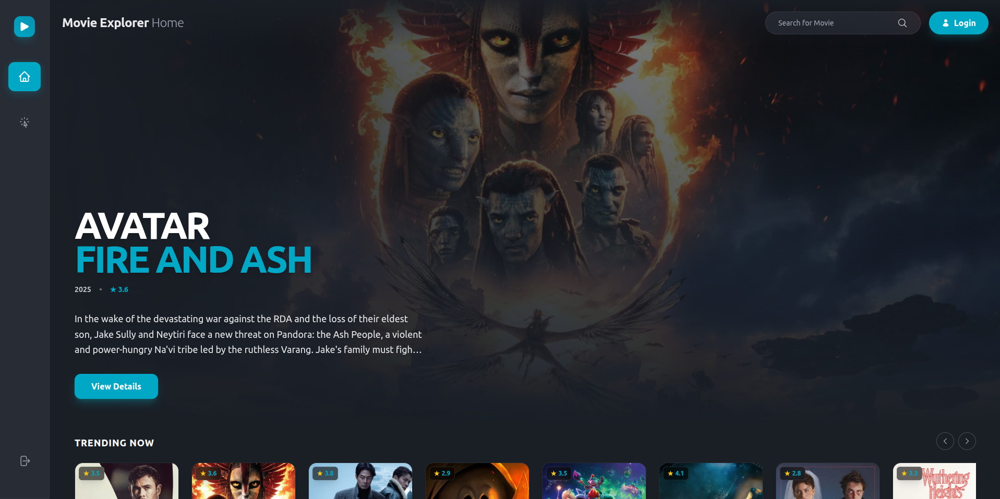
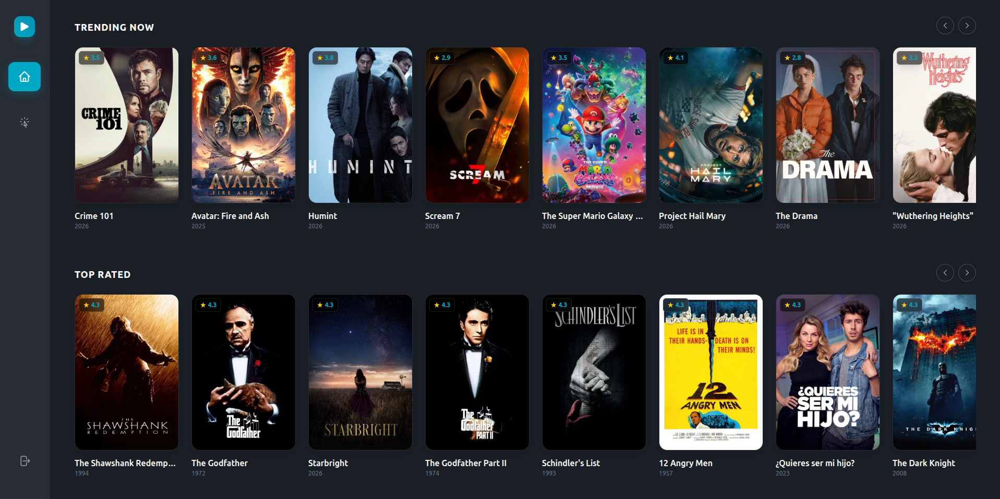
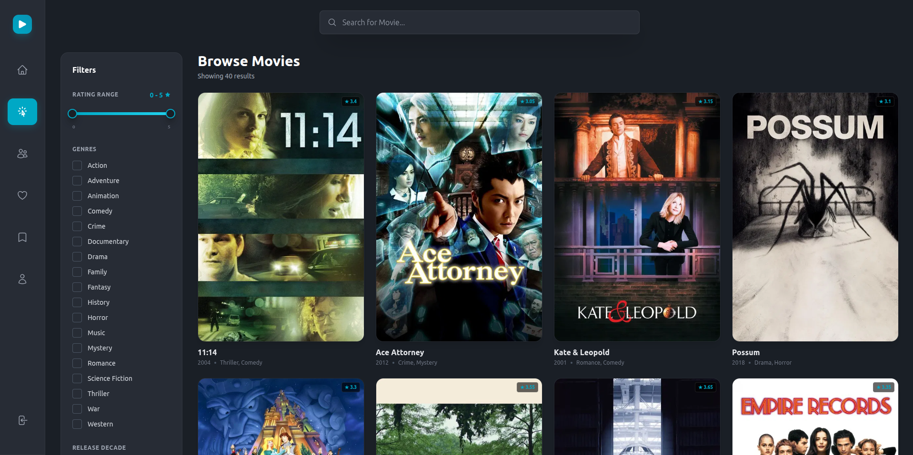
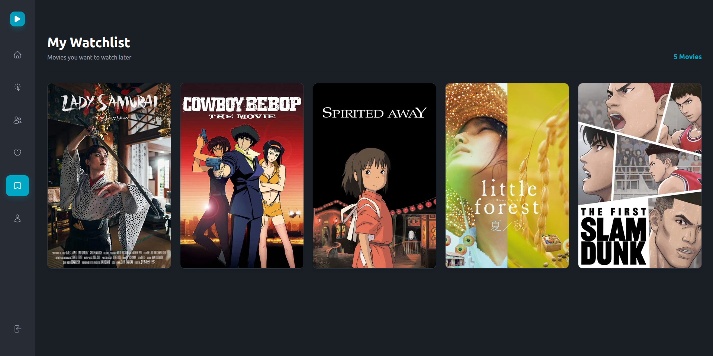
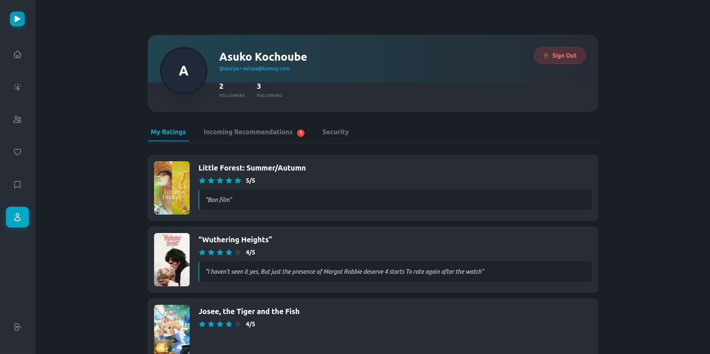
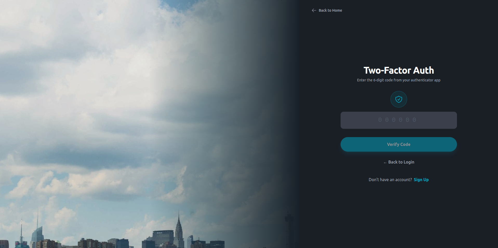
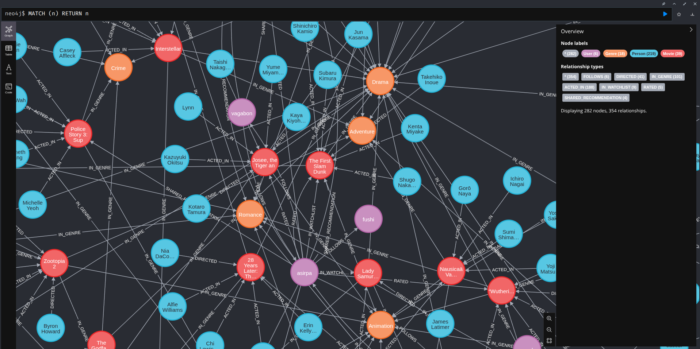

<h1 align="center">🎬 Neo4flix</h1>

<p align="center">
  <em>A graph-powered movie recommendation platform built with microservices</em>
</p>

<p align="center">
  
  
  
  
  
  
</p>

<p align="center">
  
  
  
  
  
</p>

<p align="center">
  
  
  
</p>

---

## 📸 Screenshots

<p align="center">
  
  <br/><em>Home — Hero banner with trending movies</em>
</p>

<p align="center">
  
  <br/><em>Trending Now & Top Rated carousels</em>
</p>

<p align="center">
  
  <br/><em>Browse Movies — Filter by genre, rating, and release year</em>
</p>

<p align="center">
  
  <br/><em>Personal Watchlist</em>
</p>

<p align="center">
  
  <br/><em>User Profile — Ratings, incoming recommendations & security settings</em>
</p>

<p align="center">
  
  <br/><em>Two-Factor Authentication (TOTP)</em>
</p>

<p align="center">
  
  <br/><em>Neo4j Knowledge Graph — Users, Movies, Genres, Actors & Relationships</em>
</p>

---

## 🚀 Features

### Core
- **Movie Catalog** — Browse, search, and filter movies powered by the TMDB API
- **Personalized Recommendations** — Collaborative filtering and content-based algorithms via Neo4j graph traversals
- **Star Ratings** — Rate movies (1–5 stars) with real-time average computation
- **Watchlist** — Save movies to watch later
- **Social Sharing** — Share recommendations with followed users

### Social
- **Follow / Unfollow** — Build a social graph with real-time follower/following counts
- **User Profiles** — Public profiles with ratings history and recommendation activity
- **User Search** — Case-insensitive search across all users

### Security
- **OAuth2 / OpenID Connect** — Stateless JWT authentication via Keycloak
- **Two-Factor Authentication** — TOTP-based 2FA with QR code setup
- **API Gateway** — Single entry point with JWT validation at the gateway level
- **Role-Based Access Control** — `USER` and `ADMIN` roles enforced across services

---

## 🏗️ Architecture

```
┌─────────────────────────────────────────────────────────┐
│                   Angular Frontend                      │
│                     (Port 4200)                         │
└────────────────────────┬────────────────────────────────┘
                         │
                         ▼
┌─────────────────────────────────────────────────────────┐
│                    API Gateway                          │
│              Spring Cloud Gateway MVC                   │
│                     (Port 8085)                         │
│              JWT Validation at Gateway                  │
└───────┬──────────┬──────────┬──────────┬────────────────┘
        │          │          │          │
        ▼          ▼          ▼          ▼
  ┌──────────┐ ┌──────────┐ ┌──────────┐ ┌────────────────┐
  │   User   │ │  Movie   │ │  Rating  │ │ Recommendation │
  │ Service  │ │ Service  │ │ Service  │ │    Service     │
  │  :8081   │ │  :8082   │ │  :8083   │ │     :8084      │
  └────┬─────┘ └────┬─────┘ └────┬─────┘ └───────┬────────┘
       │            │            │                │
       └────────────┴────────────┴────────────────┘
                         │
              ┌──────────┴──────────┐
              ▼                     ▼
        ┌──────────┐         ┌──────────┐
        │  Neo4j   │         │ Keycloak │
        │  :7474   │         │  :8080   │
        └──────────┘         └──────────┘
```

All four backend services are **stateless OAuth2 Resource Servers** that validate JWTs locally using Keycloak's public key. Services are only accessible through the API Gateway — no external ports are exposed.

---

## 🛠️ Technology Stack

| Layer | Technology |
|-------|-----------|
| **Frontend** | Angular 21, TypeScript 5.9, Tailwind CSS, RxJS |
| **Backend** | Java 21, Spring Boot 3.x, Spring Cloud Gateway Server MVC |
| **Database** | Neo4j (Graph Database), Spring Data Neo4j, Cypher |
| **Auth** | Keycloak (OAuth2 / OIDC), JWT, TOTP 2FA |
| **External API** | TMDB API (movie metadata, posters, trending) |
| **DevOps** | Docker, Docker Compose |

---

## 📊 Neo4j Graph Schema

### Nodes
- **User** — `username`, `email`, `firstname`, `lastname`, `enabled2FA`
- **Movie** — `tmdbId`, `title`, `releaseDate`, `description`, `posterUrl`, `runtime`
- **Genre** — `name`
- **Person** (Actor/Director) — `name`, `biography`

### Relationships
```
(:User)-[:FOLLOWS]->(:User)
(:User)-[:RATED {rating, review, timestamp}]->(:Movie)
(:User)-[:WATCHLIST]->(:Movie)
(:Movie)-[:IN_GENRE]->(:Genre)
(:Person)-[:ACTED_IN]->(:Movie)
(:Person)-[:DIRECTED]->(:Movie)
(:User)-[:SHARED_RECOMMENDATION {message, timestamp}]->(:User)
```

---

## 🔧 Microservices

### User Service (`:8081`)
- Registration with dual creation in Keycloak + Neo4j
- Login / Refresh / Logout token management
- Profile management (personal & public)
- Follow / Unfollow with graph relationships
- User search (case-insensitive)
- 2FA setup and verification

### Movie Service (`:8082`)
- TMDB-powered movie catalog with local caching in Neo4j
- Search by title, filter by genre and release year
- Trending and top-rated movie feeds
- Movie details with cast, crew, and average ratings

### Rating Service (`:8083`)
- Submit / update ratings (1–5 stars) with optional reviews
- One rating per user per movie (upsert)
- Retrieve user rating history

### Recommendation Service (`:8084`)
- **Collaborative Filtering** — "Users who rated this movie highly also rated..."
- **Content-Based** — Recommendations based on shared genres and actors
- Share recommendations with other users
- View received and sent recommendations

### API Gateway (`:8085`)
- Single entry point routing to all services
- JWT validation at the gateway level
- Path-based routing (`/api/users/**`, `/api/movies/**`, etc.)

---

## ⚡ Getting Started

### Prerequisites
- **Java 21**
- **Node.js 18+**
- **Docker & Docker Compose**
- **TMDB API Key** — [Get one here](https://www.themoviedb.org/settings/api)

### 1. Clone the repository
```bash
git clone https://github.com/TanakAiko/neo4flix.git
cd neo4flix
```

### 2. Start infrastructure (Neo4j + Keycloak)
```bash
cd user-service
docker-compose up -d
```

### 3. Configure environment variables
Create a `.env` file in the project root:
```env
NEO4J_PASSWORD=your_neo4j_password
KEYCLOAK_CLIENT_SECRET=your_client_secret
TMDB_API_KEY=your_tmdb_api_key
TMDB_READ_ACCESS_TOKEN=your_tmdb_read_token
```

### 4. Start all microservices
```bash
docker-compose up -d --build
```

### 5. Start the frontend
```bash
cd cinestream-movie-explorer
npm install
npm run dev
```

### 6. Access the application

| Service | URL |
|---------|-----|
| Frontend | `http://localhost:4200` |
| API Gateway | `http://localhost:8085` |
| Neo4j Browser | `http://localhost:7474` |
| Keycloak Admin | `http://localhost:8080` |

---

## 📁 Project Structure

```
neo4flix/
├── api-gateway/                 # Spring Cloud Gateway (entry point)
├── user-service/                # User management + Keycloak integration
├── movie-service/               # Movie catalog + TMDB proxy
├── rating-service/              # Rating system
├── recommendation-service/      # Recommendation engine
├── cinestream-movie-explorer/   # Angular frontend
├── docker-compose.yml           # Orchestration for all services
└── screenshots/                 # Application screenshots
```

---

## 👤 Author

**TanakAiko** — [GitHub](https://github.com/TanakAiko)
